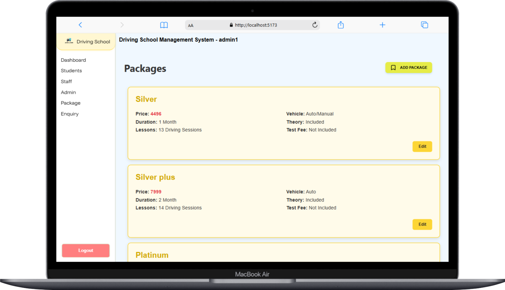
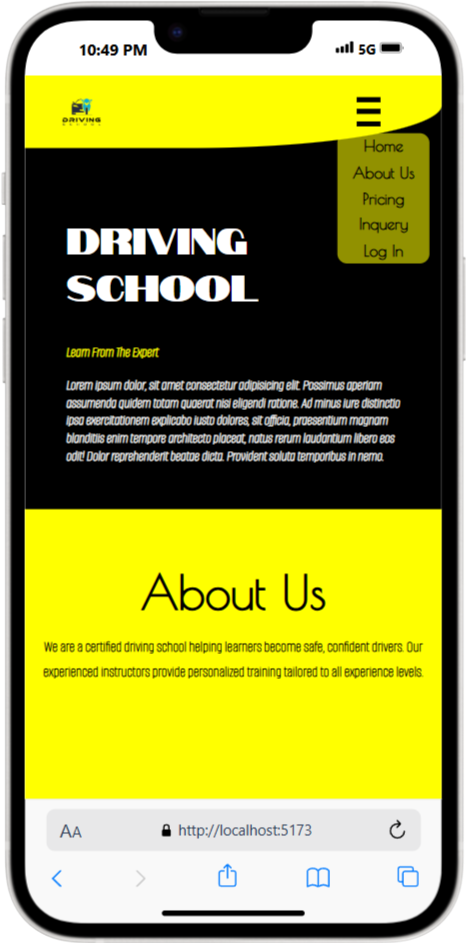
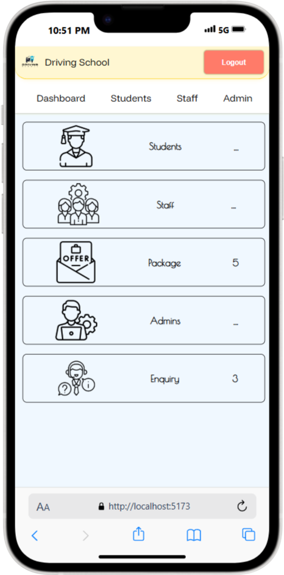
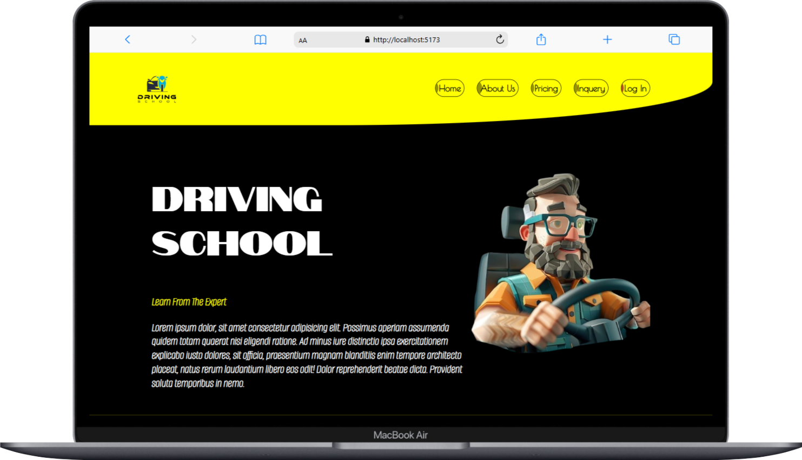

# 🚗 Driving School Management System

A full-stack web application built using the **MERN stack** (MongoDB, Express.js, React, Node.js).  
This system helps manage a driving school, including **admin registrations**, **logins**, and **role-based dashboards**.

---

## 📅 Progress Log

### 🗓️ June 7, 2025 — **Day 1**
- 📝 Edited `README.md`

### ✅ Backend Setup

#### 🔐 Authentication Features
- Created `/adminregister` route:
  - Collects `username`, `email`, `password`, `role`, etc.
  - Hashes password using `bcryptjs`
- Created `/adminlogin` route:
  - Authenticates admin using email and password
  - Generates JWT token (7-day expiration)

#### 🧩 Mongoose Schema: `admin`
```js
{
  username: String,
  email: String,
  password: String,
  isactive: Boolean,
  lastlogin: Date,
  role: String
}
```

---

### 🧑‍💻 Frontend Work (React)

- Setup login page (`Login.jsx`)
- Created login form with:
  - `email`, `password`, `role` inputs
- Used Axios for HTTP requests
- Stored JWT token and role in `localStorage`
- Redirected authenticated users to `/dashboard`

---

## 🚀 Tech Stack

| Layer       | Tech                        |
|-------------|-----------------------------|
| Frontend    | React, Axios, React Router  |
| Backend     | Node.js, Express.js         |
| Database    | MongoDB (via Mongoose)      |
| Auth        | JWT, bcryptjs               |
| Dev Tools   | nodemon, dotenv             |

---

## 🔒 Authentication Logic

- Passwords hashed with `bcrypt`
- JWT includes:
  - User ID
  - Role
  - 7-day expiration
- Role returned in login response for frontend use

---

## ⏳ Loading UI

- Every page includes a **loading animation component**
- Enhances user experience while fetching data

---

#preview





## 📦 How to Run the Project

### 🔧 Backend

```bash
npm install
npm run dev
```

### 🎨 Frontend (Vite)

```bash
cd frontend
npm install
npm run dev
```
